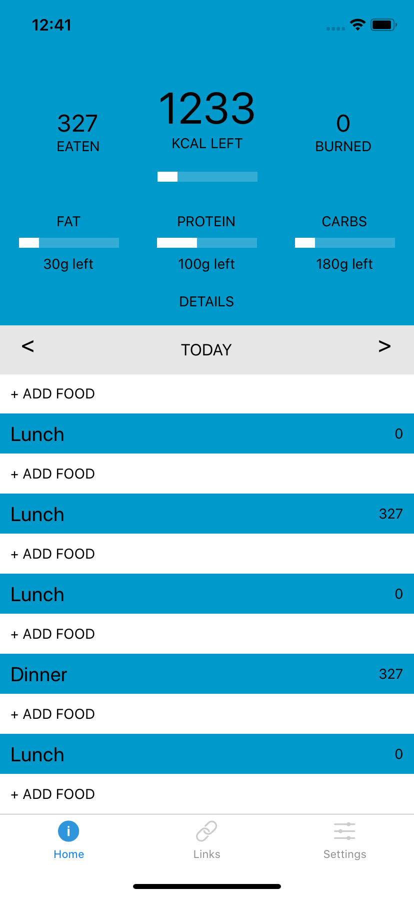
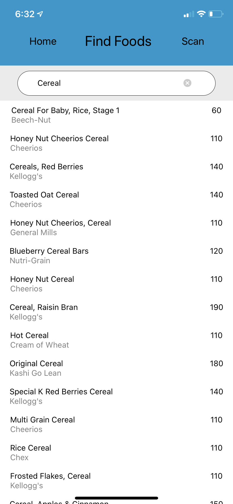
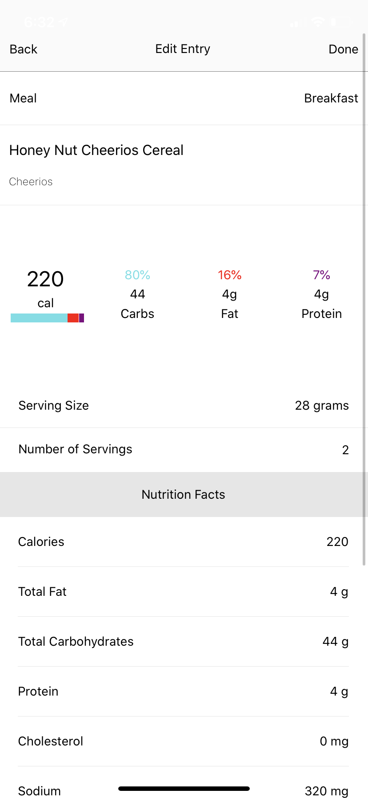

# CalsTracker



## Overview

A mobile application that will take in a users physical stats and activity level and return them a recommended daily calorie intake and a breakdown of a users daily macros (carbohydrates,proteins,and fats)

### DEMO

-TBA

## MVP

- be able to add, delete, and update food items
- be able to search for a specific food item/use a barcode scanner to find a food item
- be able to atleast keep track of the current day's calories

  
  <span></span>

## Technical Challeneges

- working with React Navigation vs React Router
- styling in react native
- working with NutritionX API
- coming up with the initial desgin and how I would proceed.

## Features

- Users have there own personalized account
- Reccomended calorie intake based on gender age, height, weight, and activity level
  - based on the recommended calories get a breakdown of daily intake for
    Carbohydrates, Protein and Fats
- Data Visualization of macros and calories for each meal based on total
- Tracks daily calorie intake

## Getting Started

If you haven't yet you need to install the Expo app on your mobile device:

- <a href='https://apps.apple.com/us/app/expo-client/id982107779'>Expo for Apple</a>
- <a href = 'https://play.google.com/store/apps/details?id=host.exp.exponent&hl=en_US'>Expo for Android</a>

After installing it you can follow the rest of the instructions

First you need to clone the repo:

```
git clone https://github.com/PhurbaSherpa/CalsTracker.git
```

The you need to change directories:

```
cd CalsTracker
```

Then you need to npm install:

```
npm install
```

Once everything is done you can start by running

```
npm run start
```

After a while it will open up a web page that gives you a qr code to scan or you can also scan the one that appears in your terminal

- once it builds that app it will take you to the start screen which is the signin/signup portion.

## Built With

- [React Native](https://facebook.github.io/react-native/) - Framework for Android and ios
- [Node.js](https://nodejs.org/en/) - JavaScript Runtime
- [react-redux](https://react-redux.js.org/) - State Management

## API Reference

- <a href="https://developer.nutritionix.com/docs/v2">NutritionX API</a>

## Author

- **Phurba Sherpa** - _Sole Developer_
